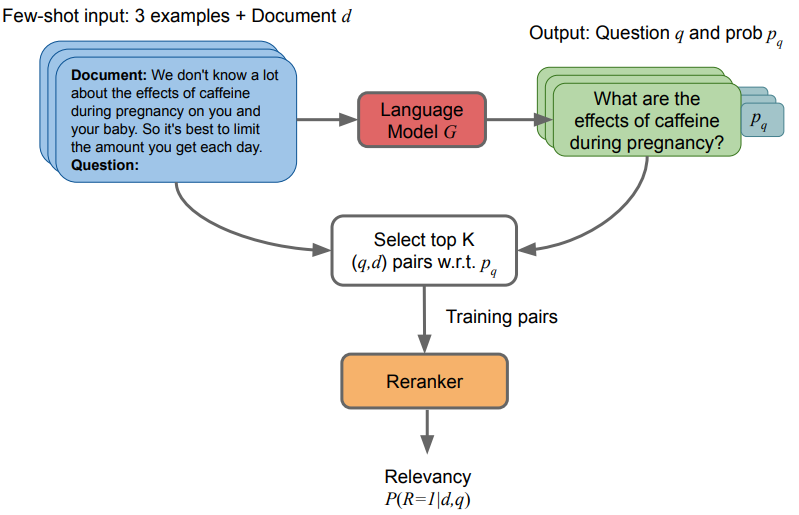

# InPars: Inquisitive Parrots for Search [](https://https://arxiv.org/abs/2202.05144)

InPars is a simple yet effective approach towards efficiently using large LMs in retrieval tasks. For more information, checkout our paper:

* [**InPars: Data Augmentation for Information Retrieval using Large Language Models**](https://arxiv.org/abs/2202.05144)

In this work, we use large LMs to generate labeled data in a few-shot manner for IR tasks.
We then finetune retrieval models on this synthetic data and use them to rerank the search results of a firs-stage retrieval system.



## How to Generate
To generate synthetic queries, we use OpenAI API.
You can generate synthetic queries for a given documents collection, using the curie model by running:

```
python generate_queries_openai.py \
    --collection path/to/collection \
    --output path/to/synthetic/queries \
    --engine curie
```

## Filtering and creating training data
Also, as reported on the paper, after generating the queries, we filter them by the score:

```
python filter_queries_by_score.py \
    --input path/to/synthetic/queries \
    --output path/to/filtered/synthetic/queries \
    --top_k 10000 \
    --scoring_function mean_log_probs
```

# Training
To train a monoT5 model using the synthetic training data, you need to generate the traning pairs by creating a positive and negative example for each query.
Using BM25 to select the negatives examples, you can create the training data by:
```
python generate_triples_train.py \
    --input path/to/filtered/synthetic/queries \
    --output path/to/synthetic.triples.train.tsv \
    --output_ids $DATA/synthetic.triples.train.ids.tsv \
    --corpus path/to/collection \
    --index pyserini-index-name
```
Finally, training a monoT5 model:

```
python train_t5.py \
    --base_model model_name_or_path \
    --corpus path/to/collection \
    --triples_train path/to/synthetic.triples.train.tsv \
    --queries path/to/eval/queries \
    --qrels path/to/eval/qrels/ \
    --run path/to/eval/run \
    --relevance_threshold 2 \
    --output_dir path/to/output/dir \
    --save_every_n_steps 156 \
    --eval_steps 156 \
    --max_eval_queries 54 \
    --max_eval_docs_per_query 1000
```

# Generated datasets

Download synthetic datasets generated by InPars:

- [MS-MARCO / TREC-DL](https://zav-public.s3.amazonaws.com/inpars/synthetic_dbpedia_curie_good_bad_more_descriptive.jsonl)
- [Robust04](https://zav-public.s3.amazonaws.com/inpars/synthetic_robust04_curie_more_descriptive.100k.jsonl)
- [Natural Questions](https://zav-public.s3.amazonaws.com/inpars/synthetic_nq_curie_good_bad_more_descriptive.jsonl)
- [TREC-COVID](https://zav-public.s3.amazonaws.com/inpars/synthetic_trec_covid_curie_good_bad_more_descriptive.jsonl)
- [FiQA](https://zav-public.s3.amazonaws.com/inpars/synthetic_fiqa_curie_good_bad_more_descriptive.jsonl)
- [DBPedia](https://zav-public.s3.amazonaws.com/inpars/synthetic_dbpedia_curie_good_bad_more_descriptive.jsonl)
- [SCIDOCS](https://zav-public.s3.amazonaws.com/inpars/scidocs_synt_queries_gptj_20_05.json)
- [SciFact](https://zav-public.s3.amazonaws.com/inpars/scifacts_synt_queries_gptj_20_05.json)
