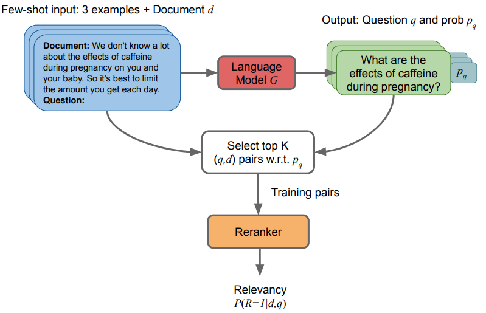

# InPars: Inquisitive Parrots for Search [](https://arxiv.org/abs/2202.05144)

InPars is a simple yet effective approach towards efficiently using large LMs in retrieval tasks. For more information, checkout our paper:

* [**InPars: Data Augmentation for Information Retrieval using Large Language Models**](https://arxiv.org/abs/2202.05144)

In this work, we use large LMs to generate labeled data in a few-shot manner for IR tasks.
We then finetune retrieval models on this synthetic data and use them to rerank the search results of a first-stage retrieval system.



## How to Generate

Download the data, including the document collection, you want to generate synthetic queries from.
Here, we are provinding data from the MS MARCO dataset.
```
bash download_data.sh
```

To generate synthetic queries using the OpenAI models, you need to provide [your API_KEY](https://beta.openai.com/account/api-keys):
```
export API_KEY=<YOUR_KEY>
```

You can generate synthetic queries, using the Curie model by running:

```
python generate_queries_openai.py \
    --collection data/msmarco/collection.tsv \
    --output data/msmarco/synthetic_queries.jsonl \
    --engine curie
```

## Filtering and creating training data
Also, as reported on the paper, after generating the queries, we filter them by the score:
<details>
<summary>What's going on here?</summary>

In this filtering step, you can choose three possible values to filter the synthetic queries to a small set.
The values are: `sum_log_probs`, `mean_log_probs` and `mean_probs`. 
For each synthetic query, there is a sequence of probabilities assigned by the LM to each token generated.
The probabilities are used to compute the query probability. 
</details>

```
python filter_queries_by_score.py \
    --input data/msmarco/synthetic_queries.jsonl \
    --output data/msmarco/filtered_synthetic_queries.jsonl \
    --top_k 10000 \
    --scoring_function mean_log_probs
```

# Training
To train a monoT5 model using the filtered synthetic queries, you need to generate the traning pairs by creating a positive and negative example for each query.
For the MS MARCO synthetic queries generated before, using BM25 to select the negatives examples, you can create the training data by:
```
python generate_triples_train.py \
    --input data/msmarco/filtered_synthetic_queries.jsonl \
    --output data/msmarco/synthetic.triples.train.tsv \
    --output_ids data/msmarco/synthetic.triples.train.ids.tsv \
    --corpus data/msmarco/collection.tsv \
    --index msmarco-passage
```
Finally, training a monoT5 model using the synthetic data:

```
python train_t5.py \
    --base_model t5_base \
    --corpus data/msmarco/collection.tsv \
    --triples_train data/msmarco/synthetic.triples.train.tsv \
    --queries data/msmarco/topics.msmarco-passage.dev-subset.txt \
    --qrels data/msmarco/qrels.msmarco-passage.dev-subset.txt \
    --run data/msmarco/run.beir-v1.0.0-trec-covid-flat.trec \
    --relevance_threshold 2 \
    --output_dir data/msmarco/ \
    --save_every_n_steps 156 \
    --eval_steps 156 \
    --max_eval_queries 54 \
    --max_eval_docs_per_query 1000
```

# Generated datasets

Download synthetic datasets generated by InPars:

- [MS-MARCO / TREC-DL](https://zav-public.s3.amazonaws.com/inpars/msmarco_synthetic_queries_100k.jsonl)
- [Robust04](https://zav-public.s3.amazonaws.com/inpars/robust04_synthetic_queries_100k.jsonl)
- [Natural Questions](https://zav-public.s3.amazonaws.com/inpars/nq_synthetic_queries_100k.jsonl)
- [TREC-COVID](https://zav-public.s3.amazonaws.com/inpars/trec_covid_synthetic_queries_100k.jsonl)
- [FiQA](https://zav-public.s3.amazonaws.com/inpars/fiqa_synthetic_queries_100k.jsonl)
- [DBPedia](https://zav-public.s3.amazonaws.com/inpars/dbpedia_synthetic_queries_100k.jsonl)
- [SCIDOCS](https://zav-public.s3.amazonaws.com/inpars/scidocs_synthetic_queries_100k.jsonl)
- [SciFact](https://zav-public.s3.amazonaws.com/inpars/scifacts_synthetic_queries_100k.jsonl)
- [Arguana](https://zav-public.s3.amazonaws.com/inpars/arguana_synthetic_queries_100k.jsonl)
- [Bioasq](https://zav-public.s3.amazonaws.com/inpars/bioasq_synthetic_queries_100k.jsonl)
- [Climate Fever](https://zav-public.s3.amazonaws.com/inpars/climate_fever_synthetic_queries_100k.jsonl)
- [Cqadupstack](https://zav-public.s3.amazonaws.com/inpars/cqadupstack_synthetic_queries_100k.jsonl)
- [Fever](https://zav-public.s3.amazonaws.com/inpars/fever_synthetic_queries_100k.jsonl)
- [Hotpotqa](https://zav-public.s3.amazonaws.com/inpars/hotpotqa_synthetic_queries_100k.jsonl)
- [Nfcorpus](https://zav-public.s3.amazonaws.com/inpars/nfcorpus_synthetic_queries_100k.jsonl)
- [Quora](https://zav-public.s3.amazonaws.com/inpars/quora_synthetic_queries_100k.jsonl)
- [Signal](https://zav-public.s3.amazonaws.com/inpars/signal_synthetic_queries_100k.jsonl)
- [Touche](https://zav-public.s3.amazonaws.com/inpars/touche_synthetic_queries_100k.jsonl)
- [Trec News](https://zav-public.s3.amazonaws.com/inpars/trec_news_synthetic_queries_100k.jsonl)
